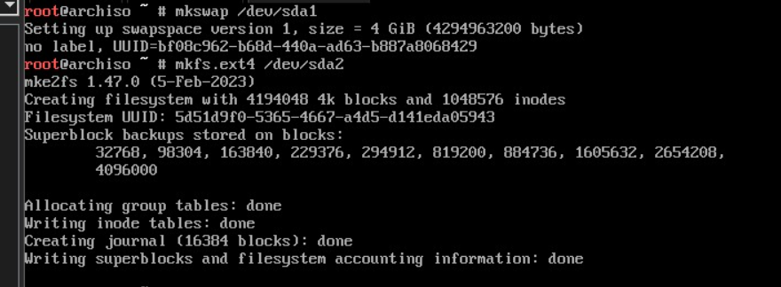
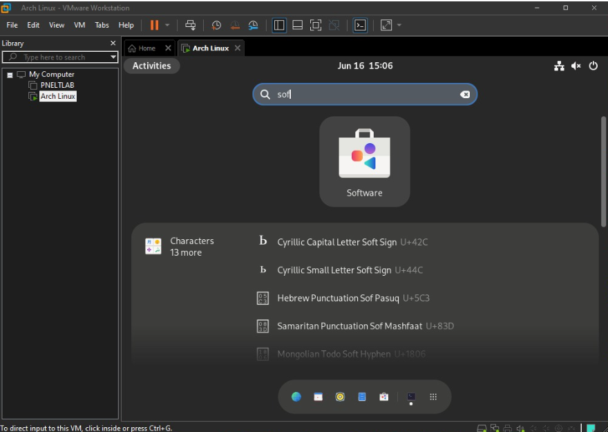

# Manual Técnico - SO2 - Practica 2

# Integrantes

| Carné | Nombre |
| --- | --- |
| 201800476 | Marvin Alexis Estrada Florian |
| 202001534 | Erwin Fernando Vásquez Peñate |
| 202000119 | Sergie Daniel Arizandieta Yol |

# Instalación de arch linx en VM

- Links de documentación y descarga del ISO

```jsx
// Documentación oficial de arch linux
https://archlinux.org
// Link de descarga del Iso
https://geo.mirror.pkgbuild.com/iso/2023.06.01/
```

- Pantalla de iniciación de arch linux


- Partición del disco


- Verificación si la bios está en uefi


- Swap


- root


- Escribir particiones


- Formatear particiones



- Montar particiones root


- Activar swap


- Descarga de paquetes base y base-devel


- Inicio de la configuración del sistema operativo


- Configurar hora para el sistema operativo, la más cercana es la de México


- Instalación de nano


- Agregar repositorio para el kernel /etc/pacman.conf


- Se agrega la llave


- Firmando para el uso del repositorio


- Instalación del kernel 5.4


- Instalación de grub


- Instalación disco (grub)


- Agregación del idioma


- Generar idioma


- Configuración del idioma


- Dejar indicada la red


- Contraseña para el root


- Instalación de sudo


- Creación de nuevo usuario y contraseña


- Agregar a los gurpos el nuevo usuario


- Descomentar


- Inicio de instalación de interfaz gráfica


- Instalación de GNOME y dejar todo por default


- Activación de interfaz gráfica y la network


- Desmontar la instalación


- Comprobación de instalación exitosa


# Instalación de herramientas

## Vim con pacman

```bash
sudo pacman -Sy
sudo pacman -S vim
```

## Go

```bash
sudo pacman -Sy
sudo pacman -S go
//Verificar la versión
go version
```

## GCC y Make

```bash
sudo pacman -Sy
sudo pacman -S gcc make
// Verificar Versiones
gcc --version
make --version
```

## Openssh

```bash
sudo pacman -Sy
sudo pacman -S openssh
start open ssh
sudo systemctl start sshd
sudo systemctl enable sshd
witch comando give me the satus of oppenssh // confirm status openssh

#Ver ip para conectase a la vm
ip address
```

## Configuración de Github

- Buscar la aplicación de github en la tienda del sistema operativo.




- Ya se podría utilizar la aplicación de github


# Módulos

## Compilación de los módulos

```jsx
// Dirigirse al directorio del módulo y ejecutar el siguiente comando
make all
```

## Limpiar la consola de mensajes

```jsx
sudo dmesg -C
```

## Inserción del modulo

```jsx
sudo insmod <<module_name>>.ko
```

## Obtener los mensajes del módulo

```jsx
sudo dmesg
```

## Información de los procesos

```jsx
// Dirigirse al directorio proc
cd /proc
// Listar módulos
ls
// Leer el archivo
cat <<module_name>>
```

## Eliminación del modulo

```jsx
sudo rmmod <<module_name>>.ko
```

## Explicación de los módulos

### Módulo De Memoria

- Para que funcione el módulo de manera correcta se necesitan estas importaciones, las cuales nos ayudan a usar información del kernel y del sistema.

```c
//Header to use the memory info
#include <linux/mm.h> 
//Allows access to functions and structures necessary for the creation and administration of kernel modules. (Mandatory)
#include <linux/module.h>
// To use kern info
#include <linux/kernel.h>
//Header to use the init and exit macros
#include <linux/init.h>
//Header necesary to use proc_ops/file_operations
#include <linux/proc_fs.h>
/* for copy_from_user */
#include <asm/uaccess.h>	
/* Header to use the seq_file library and manage the file on  /proc*/
#include <linux/seq_file.h>
```

- Métodos que se ejecutan tanto cuando se inicializa el módulo como también cuando se elimina, dejando un mensaje que puede verse con el comando “dmesg”.

```c
// Function to display the message when the module is created with insmod
static int _insert(void)
{
    proc_create("mem_grupo8", 0, NULL, &operaciones);
    printk(KERN_INFO "Hola mundo, somos el grupo 8 y este es el monitor de memoria\n");
    return 0;
}
// Function to display the message when the module is deleted with rmmod
static void _remove(void)
{
    remove_proc_entry("mem_grupo8", NULL);
    printk(KERN_INFO "Sayonara mundo, somos el grupo 8 y este fue el monitor de memoria\n");
}
```

- Función que se ejecuta al hacerle cat al módulo.

```c
//Funcion executed every time with a cat command 
static int al_abrir(struct inode *inode, struct file *file)
{
    return single_open(file, escribir_archivo, NULL);
}
```

- Dado a que se usó la versión del kernel 5.4, no se podía utilizar la struct “proc_ops”, por lo que se utilzó una struct compatible para esta versión, la cual es “file_operations”

```c
// If the kernel lower 5.6 
static struct file_operations operaciones =
{
    .open = al_abrir,
    .read = seq_read
};// Function to write the file
static int escribir_archivo(struct seq_file *archivo, void *v)
{
    // struct sysinfo
    struct sysinfo info;
    si_meminfo(&info);

    //Init the file with a {
    seq_printf(archivo, "{\n");
    //The total ram on the system
    seq_printf(archivo, "\"totalram\":%lu,\n", info.totalram * info.mem_unit / 1024 / 1024);
    //The free ram on the system
    seq_printf(archivo, "\"ramlibre\":%lu,\n", info.freeram * info.mem_unit / 1024 / 1024);
    //The occupied ram on the system
    seq_printf(archivo, "\"ramocupada\":%lu\n", (info.totalram -  info.freeram )* info.mem_unit / 1024 / 1024);
    //Closing the file with a }
    seq_printf(archivo, "}\n");

    return 0;
}
```

- Función para escribir el archivo, mediante la estructura sysinfo se obtiene la información de la memoria, en este caso se obtiene la memoria ocupada, libre y el total de memoria disponible.

```c
static int escribir_archivo(struct seq_file *archivo, void *v)
{
    struct sysinfo info;
    si_meminfo(&info);

    seq_printf(archivo, "{\n");
    seq_printf(archivo, "\"totalram\":%lu,\n", info.totalram * info.mem_unit / 1024 / 1024);
    seq_printf(archivo, "\"ramlibre\":%lu,\n", info.freeram * info.mem_unit / 1024 / 1024);
    seq_printf(archivo, "\"ramocupada\":%lu\n", (info.totalram -  info.freeram )* info.mem_unit / 1024 / 1024);
    seq_printf(archivo, "}\n");

    return 0;
}
```

### Módulo de CPU

- Para que funcione el módulo de manera correcta se necesitan estas importaciones, las cuales nos ayudan a usar información del kernel y del sistema.

```c
//Allows access to functions and structures necessary for the creation and administration of kernel modules. (Mandatory)
#include <linux/module.h>
//Header para usar KERN_INFO
#include <linux/kernel.h>
//Header para las funciones module_init y module_exit
#include <linux/init.h>
//Header necesary to use proc_ops/file_operations
#include <linux/proc_fs.h>
// Header para usar la lib seq_file y manejar el archivo en /proc*
#include <linux/seq_file.h>
//Header to use the memory info pages
#include <linux/mm.h>
// Header to use the task_struct
#include <linux/sched.h> 
#include <linux/sched/signal.h> //to recognize for_each_procces 
// Use for filp_open and filp_close
#include <linux/fs.h> 
// Reading process info 0_RDONLY
#include <linux/stat.h> 
// library for using string functions like mmemset ( to clear the buffer)
#include <linux/string.h>  
// functionalities for secure copi for copy_from_user (user space to kernel space)
#include <linux/uaccess.h> 
// Information about memory / for si_meminfo
#include <linux/sysinfo.h>
```

- Métodos que se ejecutan tanto cuando se inicializa el módulo como también cuando se elimina, dejando un mensaje que puede verse con el comando “dmesg”.

```jsx
// Function to display the message when the module is created with insmod
static int _insert(void)
{
    proc_create("cpu_grupo8", 0, NULL, &operaciones);
    printk(KERN_INFO "Hola mundo, somos el grupo 8 y este es el monitor de CPU\n");
    return 0;
}

// Function to display the message when the module is deleted with rmmod
static void _remove(void)
{
    remove_proc_entry("cpu_grupo8", NULL);
    printk(KERN_INFO "Sayonara mundo, somos el grupo 8 y este fue el monitor de CPU\n");
}

module_init(_insert);
module_exit(_remove);
```

- Función que se ejecuta al hacerle cat al módulo.

```jsx
//Funcion executed every time with a cat command v
static int al_abrir(struct inode *inode, struct file *file)
{
    return single_open(file, escribir_archivo, NULL);
}
```

- Dado a que se usó la versión del kernel 5.4, no se podía utilizar la struct “proc_ops”, por lo que se utilzó una struct compatible para esta versión, la cual es “file_operations”

```c
// If the kernel is lower 5.6 
static struct file_operations operaciones =
{
    .open = al_abrir,
    .read = seq_read
};
```

- Función que devuelve el estado de cada proceso.

```jsx
// Function to get the state of the process from the state number
static const char* obtain_state(int estado){
    const char* estado_str;
    switch (estado) {
        case 0:
            estado_str = "ejecucion";
            break;
        case 1:
        case 1026:
            estado_str = "suspendido";
            break;
        case 128:
            estado_str = "detenido";
            break;
        case 260:
            estado_str = "zombie";
            break;
        default:
            estado_str = "desconocido";
            break;
    }
    return estado_str;
}
```

- Función que calcula el porcentaje de utilización del cpu

```c
static int calcular_porcentaje_cpu_total(void)
{
    // create a file pointer
    struct file *archivo;
    char lectura[256]; // buffer
    //char *etiqueta;
    int usuario, niced, sistema, idle, iowait, irq, suaveirq, steal, guest, guest_nice; // varibles to store the CPU times
    int total;
    int porcentaje;

    archivo = filp_open("/proc/stat", O_RDONLY, 0); // open the file for reading
    if (IS_ERR(archivo)) {
        printk(KERN_ALERT "No se pudo abrir el archivo /proc/stat\n");
        return -1;
    }
    
    memset(lectura, 0, sizeof(lectura)); // clear the buffer
    kernel_read(archivo, lectura, sizeof(lectura) - 1, &archivo->f_pos); // read the file

    sscanf(lectura, "cpu %d %d %d %d %d %d %d %d %d %d",
           &usuario, &niced, &sistema, &idle, &iowait, &irq, &suaveirq, &steal, &guest, &guest_nice); // storte the CPU times in the variables

    total = usuario + niced + sistema + idle + iowait + irq + suaveirq + steal + guest + guest_nice; // calculate the total CPU time

    
    porcentaje = 100 - (idle * 100 / total); // calculate the CPU usage percentage
    filp_close(archivo, NULL); //   close the file
    
    return porcentaje;
}
```

- Función que recupera todos los procesos existentes en el sistema

```jsx
// Function to write the information to the file
static int escribir_archivo(struct seq_file *archivo, void *v){
    int porcentaje;
    porcentaje = calcular_porcentaje_cpu_total();
    if (porcentaje == -1) {
        seq_printf(archivo, "No se pudo calcular el porcentaje de CPU total\n");
    } else {
        seq_printf(archivo, "{\n");
        seq_printf(archivo, "\"totalcpu\":%d,\n", porcentaje);
        seq_printf(archivo, "\"tasks\":\n");
        int count_running = 0, count_sleeping = 0, count_stopped = 0, count_zombie = 0, count_total = 0;
        struct task_struct* cpu;
        int ram, separator, childseparator;
        separator = 0;
        childseparator = 0;
        seq_printf(archivo, "[");
        for_each_process(cpu){
            if(separator){
                seq_printf(archivo, ",");
            }
            seq_printf(archivo, "{\"pid\":");
            seq_printf(archivo, "%d", cpu->pid);
            seq_printf(archivo, ",\"nombre\":");
            seq_printf(archivo, "\"%s\"", cpu->comm);
            seq_printf(archivo, ",\"usuario\": \"");
            seq_printf(archivo, "%d", cpu->real_cred->uid);
            seq_printf(archivo, "\",\"estado\": \"");
            seq_printf(archivo, "%s", obtain_state(cpu->state));
	    seq_printf(archivo, "\"");
            if (cpu->mm) {
                ram = (get_mm_rss(cpu->mm)<<PAGE_SHIFT)/(1024*1024); // MB
                seq_printf(archivo, ",\"ram\":");
                seq_printf(archivo, "%d", ram);
            }
            seq_printf(archivo, ",\"padre\":");
            seq_printf(archivo, "%d",  cpu->parent->pid);
            seq_printf(archivo, "}\n");
            separator = 1;
            //contar 
            count_total++;
            switch(cpu->state) {
                case TASK_RUNNING:
                    count_running++;
                    break;
                case TASK_INTERRUPTIBLE:
                case TASK_UNINTERRUPTIBLE:
                    count_sleeping++;
                    break;
                case TASK_STOPPED:
                    count_stopped++;
                    break;
                case EXIT_ZOMBIE:
                    count_zombie++;
                    break;
                default:
		    count_sleeping++;
                    break;
            }
        }
        seq_printf(archivo, "],\n");
        seq_printf(archivo, "\"running\": %d,\n", count_running);
        seq_printf(archivo, "\"sleeping\": %d,\n", count_sleeping);
        seq_printf(archivo, "\"stopped\": %d,\n", count_stopped);
        seq_printf(archivo, "\"zombie\": %d,\n", count_zombie);
        seq_printf(archivo, "\"total\": %d\n", count_total);
        seq_printf(archivo, "}\n");
    }
    return 0;
}
```

# Backend

El backend para esta aplicación fue realizado en Go, en su versión 1.18.

## Importaciones necesarias

```go
import (
	"github.com/gorilla/mux" // Package for creating HTTP routers
	"github.com/rs/cors" // Package for Cross-Origin Resource Sharing (CORS) support
	"encoding/json" // Package for JSON encoding and decoding
	"io/ioutil" // Package for reading and writing files and data streams
	"net/http" // Package for HTTP client and server implementations
	"os/exec" // Package for executing external commands
	"strconv" // Package for string conversions
	"strings" // Package for manipulating strings
	"log" // Package for logging
	"fmt" // Package for formatted I/O
)
```

## Structs utilizadas

Estas structs nos sirven para almacenar la información obtenida de los módulos y poder devolverlos al front-end en un formato más fácil de digerir.

```go
// Process represents a process with its properties
type Process struct {
	Pid     int    `json:"pid"`
	Nombre  string `json:"nombre"`
	Usuario string `json:"usuario"`
	Estado  string `json:"estado"`
	Ram     int    `json:"ram"`
	Padre   int    `json:"padre"`
}

// CPUInfo represents CPU information and process tasks
type CPUInfo struct {
	TotalCPU int       `json:"totalcpu"`
	Running  int       `json:"running"`
	Sleeping int       `json:"sleeping"`
	Stopped  int       `json:"stopped"`
	Zombie   int       `json:"zombie"`
	Total    int       `json:"total"`
	Tasks    []Process `json:"tasks"`
}

// RAMInfo represents RAM information
type RAMInfo struct {
	TotalRAM    int `json:"totalram"`
	RAMLibre    int `json:"ramlibre"`
	RAMOcupada  int `json:"ramocupada"`
}

// General represents general system information
type general struct {
	TotalRAM    int `json:"totalram"`
	RAMLibre    int `json:"ramlibre"`
	RAMOcupada  int `json:"ramocupada"`
	TotalCPU    int `json:"totalcpu"`
}

// Counters represents process counters
type counters struct {
	Running  int       `json:"running"`
	Sleeping int       `json:"sleeping"`
	Stopped  int       `json:"stopped"`
	Zombie   int       `json:"zombie"`
	Total    int       `json:"total"`
}

// AllData represents all system data
type AllData struct {
	AllGenerales    []general    `json:"AllGenerales"`
	AllTipoProcesos []Process  `json:"AllTipoProcesos"`
	AllProcesos     []counters   `json:"AllProcesos"`
}

// MemoryRow represents a row of memory information
type MemoryRow struct {
	InitialAddress string   `json:"initial_address"`
	FinalAddress   string   `json:"final_address"`
	SizeKB         int      `json:"size_kb"`
	Permissions    []string `json:"permissions"`
	Device         string   `json:"device"`
	File           string   `json:"file"`
}
```

## Funciones Utilizadas

- Función que devuelve los permisos

```go
// parsePermissions parses the permissions string and returns a list of permissions
func parsePermissions(permissions string) []string {
	perms := []string{}

	if strings.Contains(permissions, "r") {
		perms = append(perms, "Lectura")
	}
	if strings.Contains(permissions, "w") {
		perms = append(perms, "Escritura")
	}
	if strings.Contains(permissions, "x") {
		perms = append(perms, "Ejecucion")
	}

	return perms
}
```

- Función que devuelve el tamaño en kb.

```go
// calculateSizeKB calculates the size in kilobytes from the initial and final addresses
func calculateSizeKB(initialAddress, finalAddress string) int {
	initial, err := strconv.ParseUint(initialAddress, 16, 64)
	if err != nil {
		return 0
	}

	final, err := strconv.ParseUint(finalAddress, 16, 64)
	if err != nil {
		return 0
	}

	size := final - initial
	sizeKB := int(size) / 1024

	return sizeKB
}
```

- Función que analiza la información del archivo “proc/pid/maps”

```go
// parseMemoryRows parses the memory rows from the output of `cat /proc/pid/maps`
func parseMemoryRows(output string) []MemoryRow {
	rows := []MemoryRow{}

	lines := strings.Split(output, "\n")
	for _, line := range lines {
		if line == "" {
			continue
		}

		fields := strings.Fields(line)
		if len(fields) < 6 {
			continue
		}

		initialAddress := strings.Split(fields[0], "-")[0]
		finalAddress := strings.Split(fields[0], "-")[1]
		permissions := fields[1]
		device := fields[3]
		file := fields[5]

		sizeKB := calculateSizeKB(initialAddress, finalAddress)

		permissionsList := parsePermissions(permissions)

		row := MemoryRow{
			InitialAddress: initialAddress,
			FinalAddress:   finalAddress,
			SizeKB:         sizeKB,
			Permissions:    permissionsList,
			Device:         device,
			File:           file,
		}

		rows = append(rows, row)
	}

	return rows
}
```

- Función que analiza la información de los módulos

```go
// createData creates the system data
func createData() (string, error) {
	// read /proc/mem_grupo8 file
	outRAM, err := ioutil.ReadFile("/proc/mem_grupo8")
	if err != nil {
		fmt.Println(err)
	}
	// read /proc/cpu_grupo8 file
	outCPU, err := ioutil.ReadFile("/proc/cpu_grupo8")
	if err != nil {
		fmt.Println(err)
	}
	// --------- PROCESS ---------
	var cpuInfo CPUInfo
	err = json.Unmarshal(outCPU, &cpuInfo)
	if err != nil {
		fmt.Println("Error: Cpu json unmarshal failed", err)
		return "", err
	}

	for i, task := range cpuInfo.Tasks {
		uid, err := strconv.Atoi(task.Usuario)
		if err != nil {
			fmt.Println("Error: Failed to convert UID to int", err)
			return "", err
		}

		// Sh -> Interpreter
		// -c -> Read the command from the argument string
		// grep -m 1 -> Show the first match
		// cut -d: -f1 -> Cuts the string at the first delimiter and displays the first field
		cmdUsr := exec.Command("sh", "-c", "grep -m 1 '"+strconv.Itoa(uid)+":' /etc/passwd | cut -d: -f1")
		

		outUsr, err := cmdUsr.Output()
		if err != nil {
			fmt.Println("Error: Failed to get username for UID ", task.Usuario, err)
			return "", err
		}
		username := strings.TrimSpace(string(outUsr))
		cpuInfo.Tasks[i].Usuario = username
	}

	// --------- RAM ---------
	var ramInfo RAMInfo
	err = json.Unmarshal(outRAM, &ramInfo)
	if err != nil {
		fmt.Println("Error: Ram json unmarshal failed", err)
		return "", err
	}
	
	// allData struct variable contains the data to send to frontend
	allData := AllData{
		AllGenerales: []general{
			{
				TotalRAM:     ramInfo.TotalRAM,
				RAMLibre:     ramInfo.RAMLibre,
				RAMOcupada:   ramInfo.RAMOcupada,
				TotalCPU:     cpuInfo.TotalCPU,
			},
		},
		AllTipoProcesos: cpuInfo.Tasks,
		AllProcesos: []counters{
			{
				Running: cpuInfo.Running,
				Sleeping: cpuInfo.Sleeping,
				Stopped: cpuInfo.Stopped,
				Zombie: cpuInfo.Zombie,
				Total: cpuInfo.Total,
			},
		},
	}

	// Marshal allData variable to json
	allDataJSON, err := json.Marshal(allData)
	if err != nil {
		fmt.Println("Error: AllData json marshal failed", err)
		return "", err
	}

	return string(allDataJSON), nil
}
```

## Servidor

El servidor fue configurado gracias a la librería “gorilla/mux” que nos ofrece Go.

```go
func main() {
	fmt.Println("************************************************************")
	fmt.Println("*                 SO2 Practica 2 - Grupo 8                 *")
	fmt.Println("************************************************************")

	router := mux.NewRouter().StrictSlash(true) // Create a new router instance
	router.HandleFunc("/", handleRoute) // Set the handler function for the root route ("/")
	router.HandleFunc("/tasks", handlePost).Methods("POST") // Set the handler function for the "/tasks" route with POST method
	router.HandleFunc("/tasks", handleGet).Methods("GET") // Set the handler function for the "/tasks" route with GET method
	router.HandleFunc("/memory", handleMemory).Methods("POST")

	handler := cors.Default().Handler(router) // Create a new CORS handler with default settings
	log.Fatal(http.ListenAndServe(":8080", handler)) // Start the HTTP server and listen on port 8080

	fmt.Println("Server on port 8080")
}
```
