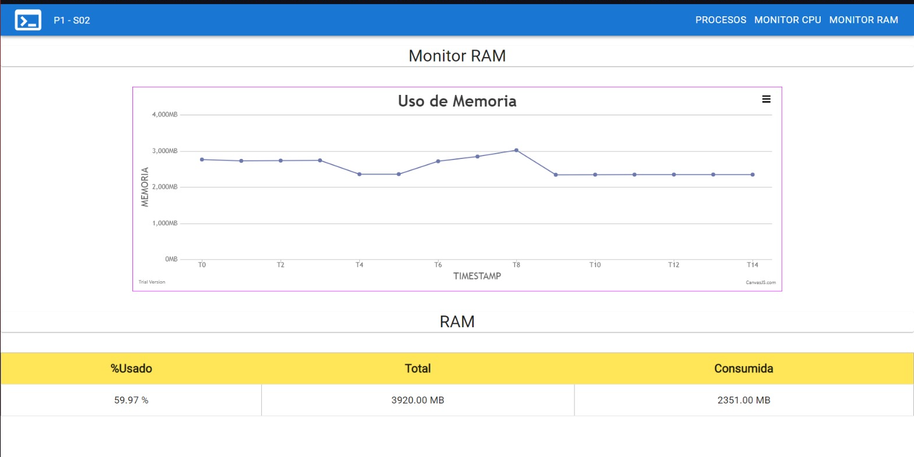
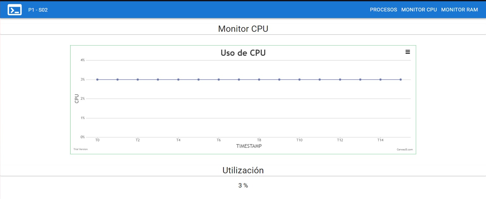
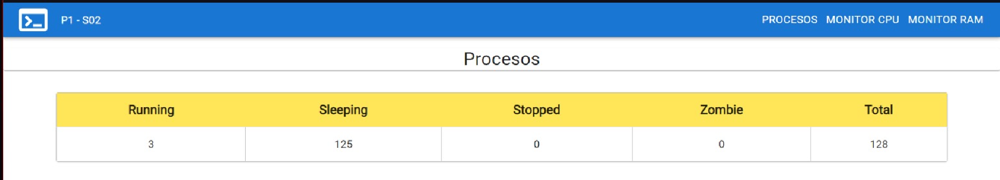
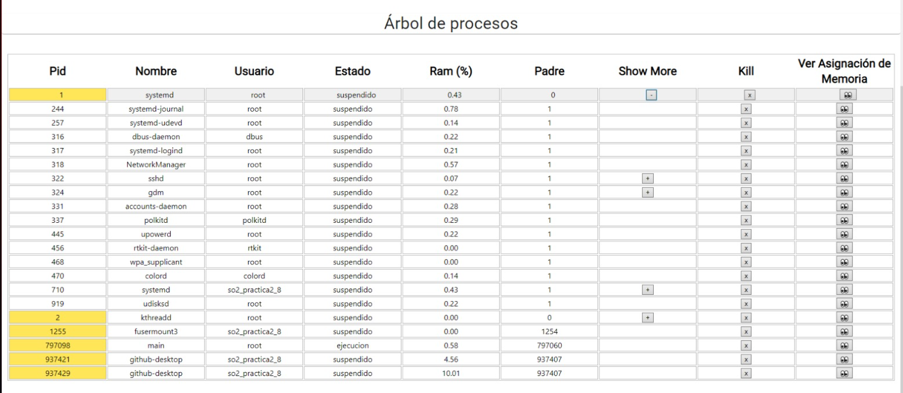
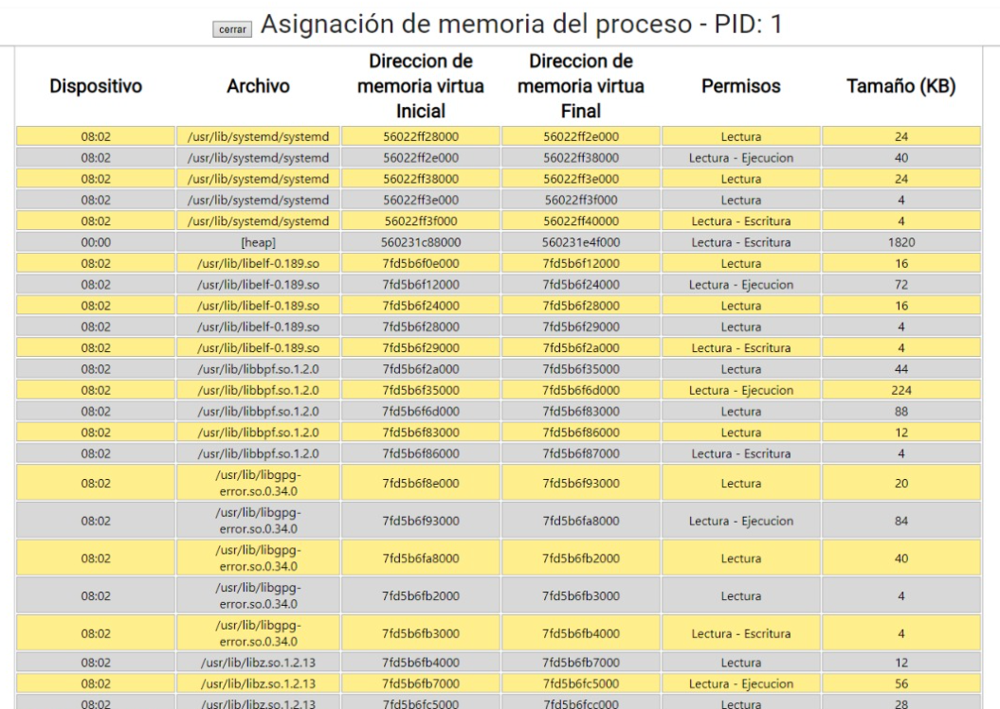

# Manual De Usuario - SO2 - Practica 2

# Integrantes

| Carné | Nombre |
| --- | --- |
| 201800476 | Marvin Alexis Estrada Florian |
| 202001534 | Erwin Fernando Vásquez Peñate |
| 202000119 | Sergie Daniel Arizandieta Yol |

# Tecnologías utilizadas

- ReactJs → Utilizado en la implementación de la parte visual de la aplicación.
- Go → Utilizado para gestionar el servidor necesario, en el cual el cliente pueda consultar la información necesaria.
- C → Lenguaje utilizado para la creación de los módulos del kernel.

# Funcionalidades

## Monitor Ram

Este monitor mostrará toda la información detallada de la memoria utilizada en tiempo real de manera intuitiva mediante una gráfica, además abajo de esta se encuentran los datos de uso de la memoria.

## Monitor CPU

Este monitor mostrará toda la información detallada de la memoria utilizada en tiempo real de manera intuitiva mediante una gráfica, además abajo de esta se encuentran los datos de uso del CPU.

## Contador de procesos

Mediante una tabla se le mostrará al usuario un conteo general de los procesos en base a su estado.

## Árbol de procesos

Esta sección mostrará todos los procesos existentes con toda su información, además tendrá disponible un botón para ver los procesos hijos de un proceso si es que tuviera, también hay un botón mediante el cual podremos terminar con la ejecución de un proceso y un botón con el cual se podrá visualizar de manera personalizada la asignación de memoria del proceso seleccionado.

# Asignación de memoria

Esta sección mostrará los permisos, las direcciones de memoria virtual inicial y final, además del tamaño de memoria del Proceso seleccionado en base a su PID.

